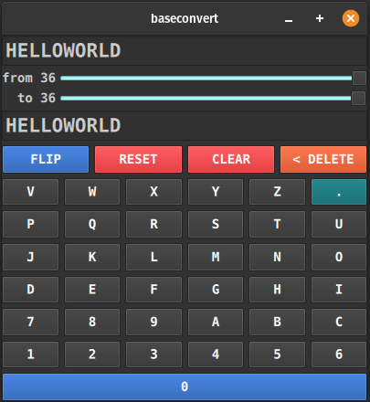

baseconvert
===========

Convert rational numbers between bases.



[https://github.com/BreadMakesYouFull/baseconvert](https://github.com/BreadMakesYouFull/baseconvert)

## Install

Requires:
* python 3
* pyside6 for GUI

```
# Install from pypi via pip
# Without GUI:
pip install baseconvert
# With GUI:
pip install baseconvert[gui]

# ...or install from source
git clone https://github.com/BreadMakesYouFull/baseconvert
python -m venv venv
# With GUI
./venv/bin/pip install .[gui]
# Without GUI
./venv/bin/pip install .

```

## Run UI

```
baseconvert
```

## Python Library

Convert any rational number, from any positive integer base, to any positive integer base.

Output numbers as tuple or string.

- Any rational number
- Arbitrary precision
- Fractions
- Recurring/repeating fractional digits.
- Input numbers as tuple or string or number.
- Output numbers as tuple or string.

```
# base(number, input_base, output_base)
>>> base((15, 15, 0, ".", 8), 16, 10)
(4, 0, 8, 0, '.', 5)

>>> base("FF0.8", 16, 10, string=True)
'4080.5'

>>> base("4080.5", 10, 16, string=True)
'FF0.8'
```

Or from command line

     $ echo 4080.5 | python -m baseconvert -i 10 -o 16
     FF0.8

     $ python -m baseconvert -n 4080.5 -i 10 -o 16
     FF0.8

### Tuple representation

Numbers are represented as a sequence of digits.
Each digit is a base-10 integer value.
The radix point, which separates  the integer and fractional parts,
is denoted by a string period.

     (int, int, int, ... , '.', ... , int, int, int)
     (   integer part    , '.',  fractional part   )

### String representation

String digits (after z the values are in ascending Unicode):

    0123456789ABCDEFGHIJKLMNOPQRSTUVWXYZabcdefghijklmnopqrstuvwxyz

    |  Value  | Representation |
    |---------|----------------|
    |  0 -  9 |    0  -  9     |
    | 10 - 35 |    A  -  Z     |
    | 36 - 61 |    a  -  z     |
    | 62 +    | unicode 123 +  |

    For higher bases it's recommended to use tuple representation.

### Examples

    # base(number, input_base, output_base)
    >>> n = (15,15,".",0,8)
    >>> base(n, 16, 10)
    (2, 5, 5, '.', 0, 3, 1, 2, 5)
    >>> base(n, 16, 10, string=True)
    '255.03125'

    >>> base("FF.08", 16, 10) == base((15,15,".",0,8), 16, 10)
    True

    # A callable BaseConverter object can also be created.
    # This is useful for when several numbers need to be converted.

    >>> b = BaseConverter(input_base=16, output_base=8)
    >>> b("FF")
    (3, 7, 7)
    >>> b((15, 15))
    (3, 7, 7)
    >>> b("FF") == b((15,15))
    True

    >>> base(0.1, 3, 10, string=True)
    '0.[3]'

### Recurring digits

Recurring digits at the end of a fractional part will be enclosed by
"[" and "]" in both string and tuple representation. 
This behavior can be turned off by setting the recurring argument of base or
BaseConverter object to False.

    >>> base("0.1", 3, 10, string=True)
    '0.[3]'
    >>> base("0.1", 3, 10, string=True, recurring=False)
    '0.3333333333'

### Max fractional depth

Integer parts are always of arbitrary size.
Fractional depth (number of digits) can must be specified by setting the
max_depth argument of base or a BaseConverter object (default 10).

    >>> base("0.2", 10, 8)
    (0, '.', 1, 4, 6, 3, 1, 4, 6, 3, 1, 4)
    >>> base("0.2", 10, 8, max_depth=1)
    (0, '.', 1)

### Exact...ish

You can also set ``max_depth=0`` or use the flag ``exact=True``, which are equivalent. These "Exact" results will be only precise only up to the value of ``baseconvert.baseconvert.MAX_DEPTH`` which you may also override, but is limited by default for speed.

This is only relevant for fractional numbers, integer values should always be accurate.
